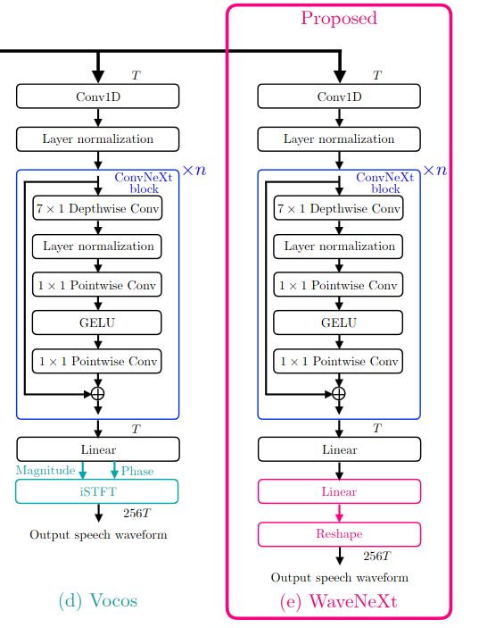

# wavenext_pytorch
## WaveNext: ConvNext-Based fast neural vocoder without ISTFT layer
### Autorhs: Takuma Okamoto, Haruki Yamashita Yamato Ohtani1, Tomoki Toda and Hisashi Kawai1

Unofficial implementation of wavenext neural vocoder(WIP)

[WaveNext](https://ieeexplore.ieee.org/document/10389765) proposed to replace the ISTFT final layer of Vocos with a linear layer without bias followed by a reshape op. As this is a slight modification of vocos we're  just using the [official vocos implementation](https://github.com/gemelo-ai/vocos) and adding the WaveNext head in wavenext_pytorch/vocos/heads.py 



We also added the modifications in the feature extraction and mel spec loss to make it compatible with the HifiGAN features, However, you can also use the original features from Vocos. 

## Installation

To use Vocos only in inference mode, install it using:

```bash
pip install -r requirements.txt
```

If you wish to train the model, install it with additional dependencies:

```bash
pip install -r requirements-train.txt
```


## Training


Prepare a filelist of audio files for the training and validation set:

```bash
find $TRAIN_DATASET_DIR -name *.wav > filelist.train
find $VAL_DATASET_DIR -name *.wav > filelist.val
```

Fill a config file, e.g. [wavenext.yaml](configs%2Fwavenext.yaml), with your filelist paths and start training with:

```bash
python train.py -c configs/wavenext.yaml
```

Refer to [Pytorch Lightning documentation](https://lightning.ai/docs/pytorch/stable/) for details about customizing the
training pipeline.

## Todo

- [ ] Add tensorboards.
- [ ] Add encodec config.

## Citation

If this code contributes to your research, please cite the work:
```
@INPROCEEDINGS{10389765,
  author={Okamoto, Takuma and Yamashita, Haruki and Ohtani, Yamato and Toda, Tomoki and Kawai, Hisashi},
  booktitle={2023 IEEE Automatic Speech Recognition and Understanding Workshop (ASRU)}, 
  title={WaveNeXt: ConvNeXt-Based Fast Neural Vocoder Without ISTFT layer}, 
  year={2023},
  volume={},
  number={},
  pages={1-8},
  keywords={Fourier transforms;Vocoders;Conferences;Automatic speech recognition;ConvNext;end-to-end text-to-speech;linear layer-based upsampling;neural vocoder;Vocos},
  doi={10.1109/ASRU57964.2023.10389765}}
```


## License

The code in this repository is released under the MIT license as found in the
[LICENSE](LICENSE) file.
